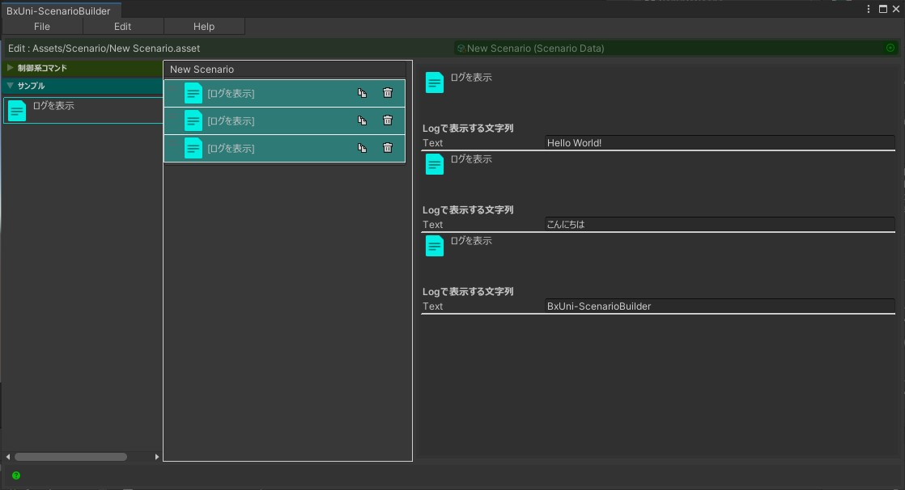
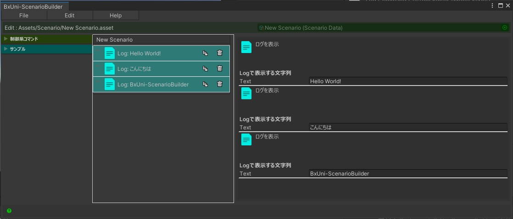
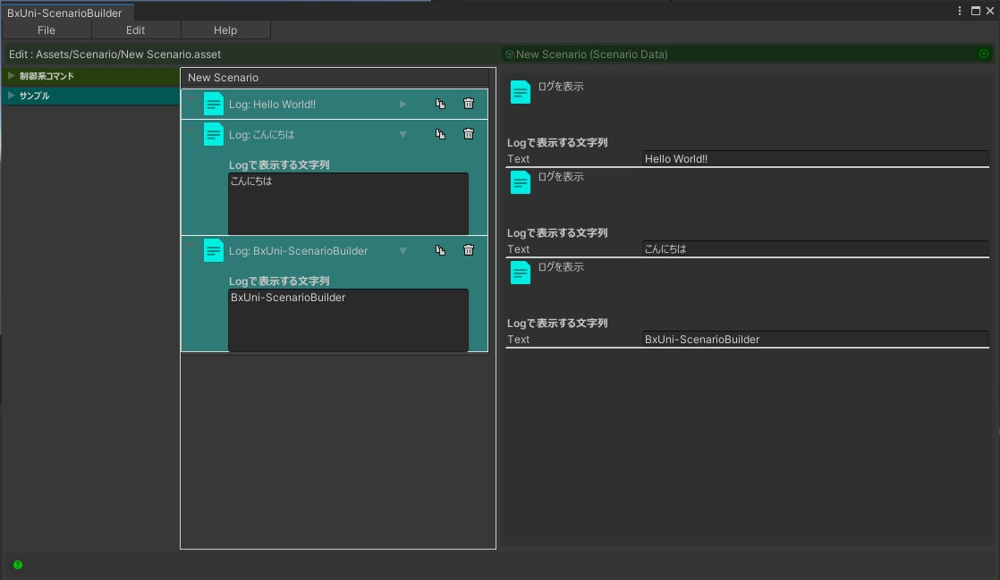
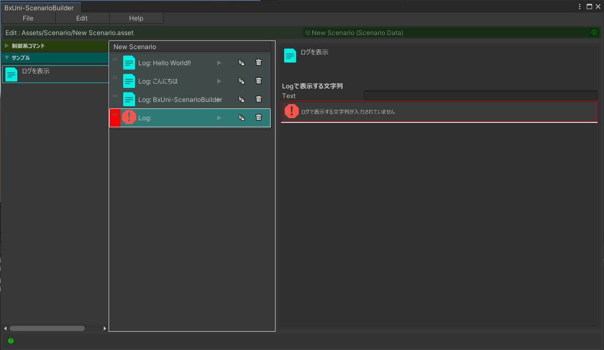

# BxUni Scenario Builder 「Editor Extensions」

---

## 編集ウィンドウ上でのコマンドの表示を拡張する  
以下の画像の`[ログを表示]`のように、コマンドを中央に並べた時`[コマンド名]`と表示されますが、大量に並べた時にパッと見どのようなパラメータ指定がされているか分かりずらいです。  
(以下の画像では出力するログの文字列がそれぞれ違います。)  
  

このような状態を回避するために表示をEditor拡張で変更できるようにしています。  
試しにこのLogCommandの表示を変えて見ます。  
(Editorフォルダ以下に拡張用のC#スクリプトを作成します。)

```csharp

using UnityEngine;
using UnityEditor;
using BxUni.ScenarioBuilder.Editor;                        //usingで指定

[CustomCommandEditor(typeof(LogCommand))]                  //CustomCommandEditorAttributeを付ける
public class LogCommandCustomEditor : CustomCommandEditor  //CustomCommandを継承する
{
    LogCommand Cmd => target as LogCommand;                

    public override void OnGUI(Rect rect)                  //OnGUIメソッドをoverride
    {                                                      //この中で描画処理を書く
        EditorGUI.LabelField(rect, $"Log: {Cmd.Text}");
    }
}

```

上記のようなEditor拡張を作成すると表示が変わっている事が確認できます。  
  

またここの表示範囲では狭いという場合にはPreviewAreaを実装する方法もあります。
```csharp

using UnityEngine;
using UnityEditor;
using BxUni.ScenarioBuilder.Editor;

[CustomCommandEditor(typeof(LogCommand))]
public class LogCommandCustomEditor : CustomCommandEditor
{
    LogCommand Cmd => target as LogCommand;                

    public override void OnGUI(Rect rect)
    {
        EditorGUI.LabelField(rect, $"Log: {Cmd.Text}");
    }

    public override bool HasPreviewArea() // HasPreviewAreaをoverrideし、TRUEで返すとPreviewAreaを表示することが出来る
    {
        return true;
    }

    public override void OnPreviewAreaGUI(Rect rect, SerializedProperty property) // OnPreviewAreaGUIをoverride
    {                                                                             // この中で描画処理を書く
        var textProperty = property.FindPropertyRelative("m_text");
        EditorGUI.PropertyField(rect, textProperty, GUIContent.none);
    }

    public override float GetPreviewAreaHeight(SerializedProperty property)       // GetPreviewAreaをoverride
    {                                                                             // PreviewAreaの高さを変えることが出来る
        return 128.0f;
    }
}

```

上記のようにHasPreviewArea、OnPreviewAreaGUIの2つ（GetPreviewAreaHeightは任意）をoverrideすることでPreviewAreaを表示するを実装することが出来ます。  
  

また、例えばコマンド内のパラメータで不正な入力があった場合事前にエラーを表示したい場合はValidateメソッドをoverrideすることでエラーを表示することが出来ます。  

```csharp

using UnityEngine;
using UnityEditor;
using BxUni.ScenarioBuilder.Editor;

[CustomCommandEditor(typeof(LogCommand))]
public class LogCommandCustomEditor : CustomCommandEditor
{
    LogCommand Cmd => target as LogCommand;                

    public override void OnGUI(Rect rect)
    {
        EditorGUI.LabelField(rect, $"Log: {Cmd.Text}");
    }

    public override bool HasPreviewArea()
    {
        return true;
    }

    public override void OnPreviewAreaGUI(Rect rect, SerializedProperty property)
    {
        var textProperty = property.FindPropertyRelative("m_text");
        EditorGUI.PropertyField(rect, textProperty, GUIContent.none);
    }

    public override float GetPreviewAreaHeight(SerializedProperty property)
    {
        return 128.0f;
    }

    public override bool Validate(out string errorLog) // Validateをoverride
    {
        errorLog = string.Empty;

        if (string.IsNullOrEmpty(Cmd.Text))
        {
            errorLog = $"ログで表示する文字列が入力されていません";
        }

        return string.IsNullOrEmpty(errorLog);         // 問題なければTRUE,エラーであればFALSE
    }
}

```
例えばTextが空文字だったらエラーを表示するという場合は上記のように実装します。  
そうするとエラーが表示されるのが一目で分かるようになります。  
`errorLog`にいれた文字列が表示されていることが分かります。  
