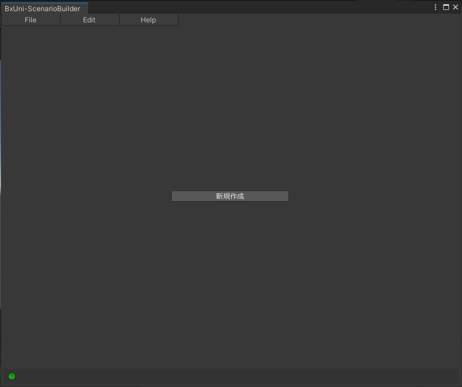
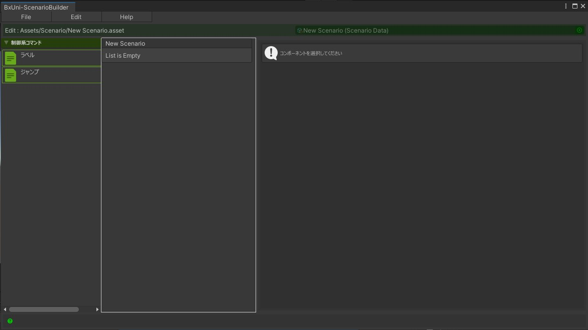
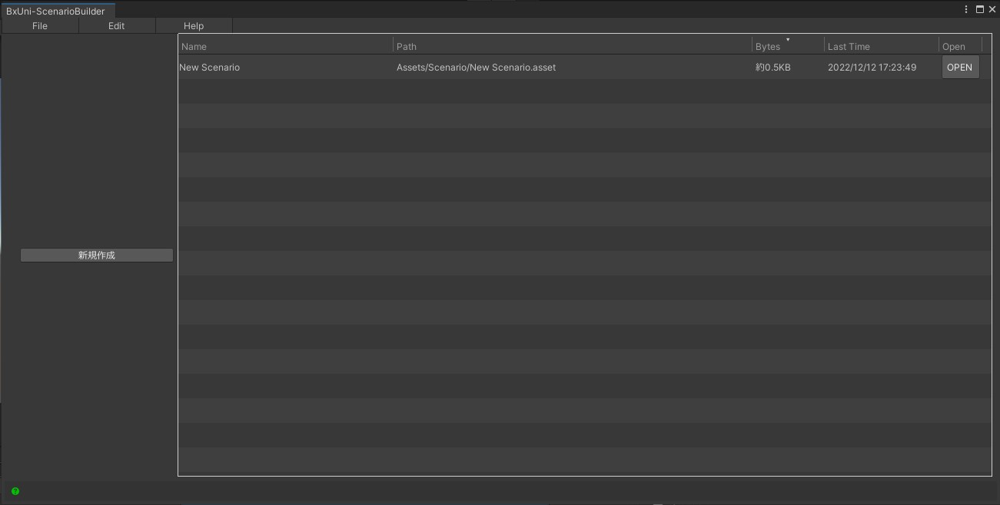
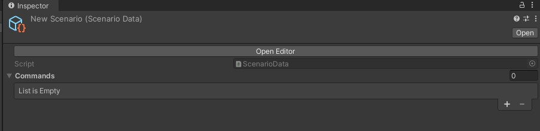
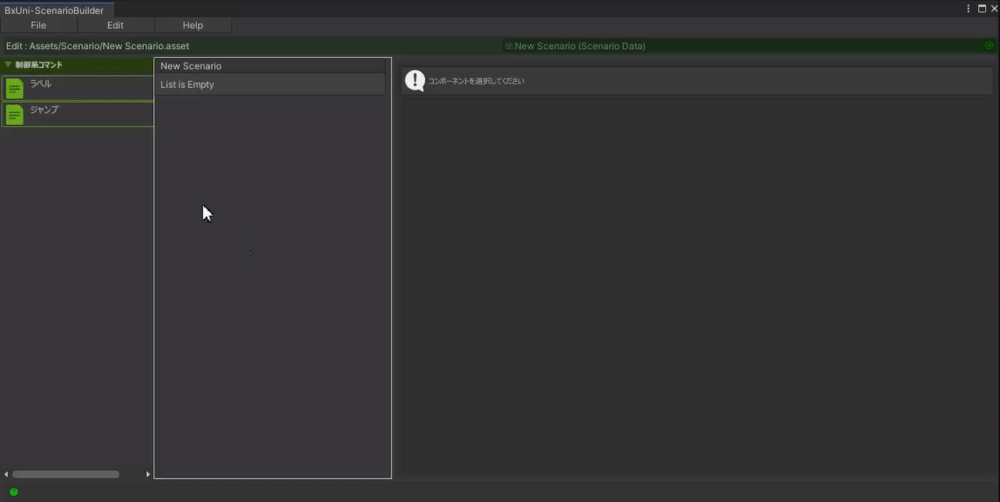
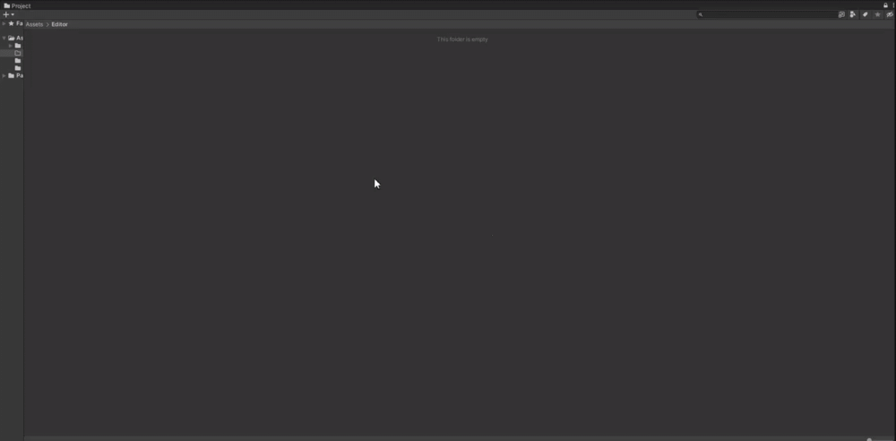
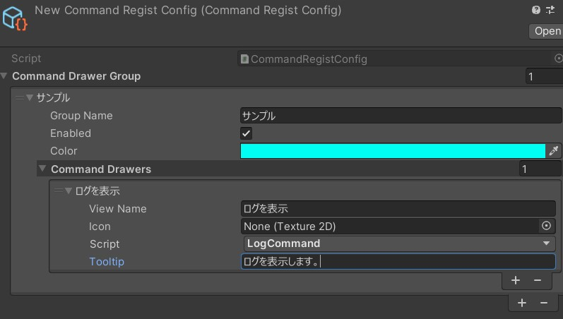
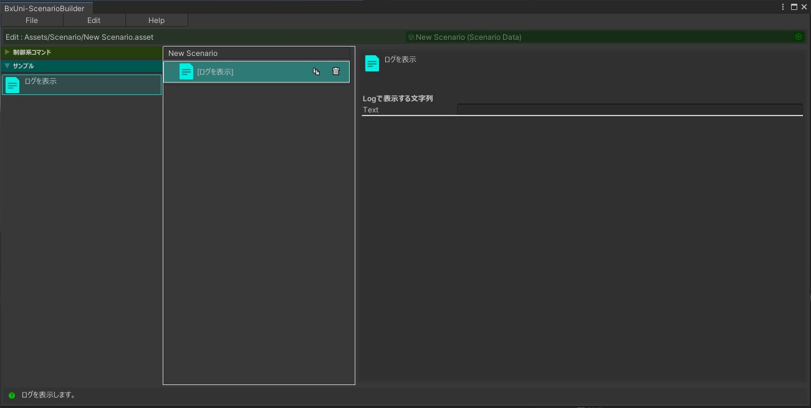
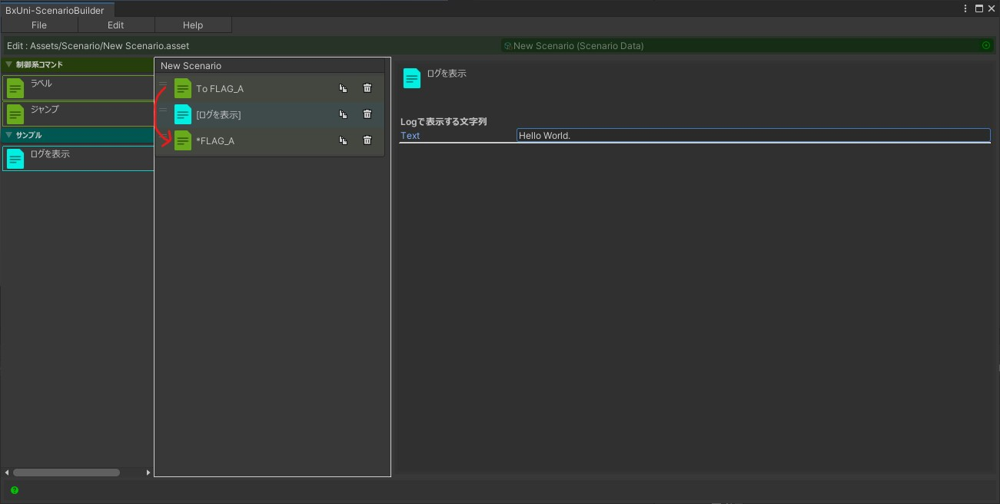

# BxUni Scenario Builder

## Unityバージョン
Unity2021.3以降

---

## 使用方法

### 編集ウィンドウの起動  
* UnityEditorメニュー → BeXide -> ScenarioBuilder -> Edit

起動するとウィンドウが開きます。
プロジェクト内にシナリオファイルが存在しない場合、中央に「新規作成」のボタンが表示されます。


「新規作成」のボタンを押し、シナリオファイルを保存する場所を決めて作成します。


※1.プロジェクト内に1つでもシナリオファイルが存在する場合は、ウィンドウを開いたときに一覧が表示されます。  
一覧内から編集したいシナリオファイルをダブルクリック、もしくは「OPEN」ボタンで編集を始めることが出来ます。  


※2.作成したシナリオファイルのInspectorから「OpenEditor」ボタンを押すことで編集ウィンドウを開くことも出来ます。


### シナリオファイルの編集方法
1. 左側のエリアに並んでいるコマンドを中央の白枠内のエリアにドラッグ＆ドロップします。
2. 編集したいコマンドを左クリックすることで右側のエリア内でコマンドに対応する各パラメータを編集することが出来ます。


### シナリオファイルの再生方法
基本的にはUnityで実装されている「Timeline」に近いような作りになっています。

1. 任意のGameObjectに「CommandEngineDirector」というコンポーネントを貼ります。
2. 「CommandEngineDirector」を付けたGameObjectの子に1つ以上GameObjectを作成し、そのGameObjectに「BaseCommandRunner」を継承したコンポーネントを貼ります。
3. 「CommandEngineDirector」のInspectorを見ると「ScenarioAsset」というプロパティがあるので、そこに再生したいシナリオファイルを指定します。
- もう1つ「PlayOnAwake」というプロパティがありますが、これはAwake時に再生をするかどうかのチェックになりますので、必要に応じて使い分けてください。

#### (別解)プログラム側からシナリオファイルを再生する。
例えばAddressablesからシナリオファイルを読み込んでCommandEngineDirectorに渡し再生するという事も可能です。
```csharp
using BxUni.ScenarioBuilder;

[SerializeField] CommandEngineDirector m_director;

var scenarioAsset = await Addressables.LoadAsync<ScenarioAsset>(key);
m_director.Initialize(scenarioAsset);
m_director.Play();

```

---

## プログラム

### 新規でコマンドを作成する方法
以下の手順でオリジナルのコマンドを作成することが出来ます。
ここではコマンドのパラメータとして指定した文字列をDebug.Logで表示するサンプルをもとに説明します。

1. BaseCommandクラスを継承したクラスを作成する
``` csharp
using UnityEngine;
using BxUni.ScenarioBuilder;          //usingで指定

[System.Serializable]                 //System.SerializableAttributeを付ける
public class LogCommand : BaseCommand //BaseCommandを継承する
{
    [Header("Logで表示する文字列")]
    [SerializeField] string m_text;   //コマンドのパラメータを宣言

    /// <summary>
    /// Logで表示する文字列
    /// </summary>
    public string Text => m_text;     //CommandRunner側で読み取れるようにgetterプロパティを追加
}

```

2. 作成したコマンドを処理するためにBaseCommandRunnerを継承したクラスを用意する
```csharp
using BxUni.ScenarioBuilder;                      //usingで指定

public class LogCommandRunner : BaseCommandRunner //BaseCommandRunnerを継承する
{

    [CommandRunner(typeof(LogCommand))]           //CommandRunnerAttributeを付けたメソッドを用意する
                                                  //CommandRunnerAttributeの引数に対応するコマンドのTypeを指定する
    public void DumpLog(LogCommand cmd)           //メソッドの名前は任意で、引数に対応するコマンドを指定する
    {
        Debug.Log(cmd.Text);
    }

}

```

3. Projectウィンドウ内のEditorフォルダ以下で右クリックをし、Create > BeXide > ScenarioBuilder > CommandRegistConfig をクリックしてCommandRegistConfig.assetを作成します。

※基本プロジェクトに1つあればいいので、2回目以降はこの手順はスキップ可




4. CommandRegistConfig.assetに情報を追加していきます。

- +ボタンを押してグループを追加します。
 - 「Group Name」に任意のグループ名を入力します。
 - 「Enabled」にチェックを入れます。
 - 「Color」に任意の色を指定します。
 - 「Command Drawers」のリストで＋ボタンを押します。
  - 「View Name」にコマンドを表す名前を入力します。
  - （対応しなくても可）「Icon」に任意のTextureを参照させると、編集ウィンドウ内のアイコンが変わります。
  - 「Script」でコマンドのMonoScriptを指定します。（今回だとLogCommand.cs）
  - 「Tooltip」にコマンドの説明を入力します。



以上の対応で完了です。  


### 特殊なコマンドについて
1. 待機コマンド

指定秒待機したり、何かの動作を待機したりなど非同期な処理を行う場合はCommandRunnerのメソッドの返値を`System.Threading.Tasks.Task`、もしくは`Cysharp.Threading.Tasks.UniTask`にすればOKです。
```csharp
// System.Threading.Tasks.Task の例
using System.Threading;
using System.Threading.Tasks;

[CommandRunner(typeof(ExampleTaskCommand))]
public async Task WaitDelayTask(ExampleTaskCommand cmd, CancellationToken ct = default)
{
    //指定秒待機したら次のコマンドが実行されます。
    await Task.Delay(System.TimeSpan.FromSeconds(cmd.Sec));
}

// Cysharp.Threading.Tasks.UniTask の例
using System.Threading;
using Cysharp.Threading.Tasks;

[CommandRunner(typeof(ExampleTaskCommand))]
public async UniTask WaitDelayTask(ExampleTaskCommand cmd, CancellationToken ct = default)
{
    //指定秒待機したら次のコマンドが実行されます。
    await UniTask.Delay(System.TimeSpan.FromSeconds(cmd.Sec));
}

```

2. ジャンプコマンド  
パッケージを入れた時から使用出来る「ラベルコマンド」と「ジャンプコマンド」があります。  
例えば以下の画像のように設定すると1個目のジャンプコマンドで3個目のラベルコマンドにジャンプするので
2個目のLogCommandは無視されます。  


この仕組みを利用し、自作のジャンプコマンドを用意することが出来ます。  
ここではコマンド側で指定した複数のラベルからランダムで1つ選択し、そこへジャンプするサンプルを書いてみます。

```csharp
// Command
using UnityEngine;
using BxUni.ScenarioBuilder;

[System.Serializable]
public class RandomJumpCommand : BaseCommand
    , IJumpCommand                                  // IJumpCommand のインターフェースを実装する
{
    [Header("ジャンプ先のラベル")]
    [SerializeField, LabelCommand]
    string[] m_targetLabels = new string[0];

    /// <summary>
    /// ジャンプ先のラベル
    /// </summary>
    public string[] TargetLabels => m_targetLabels;
}

// CommandRunner
using UnityEngine;
using BxUni.ScenarioBuilder;

public class RandomJumpCommandRunner : BaseCommandRunner
{
    [CommandRunner(typeof(RandomJumpCommand))]
    public string RandomJump(RandomJumpCommand cmd)           // 返値をstringにする
    {
        int index = Random.Range(0, cmd.TargetLabels.Length);
        string label = cmd.TargetLabels[index];
        return label;　　　　　　　　　　　　　　　　　　　　　　// ジャンプ先のラベル名を返す
    }


    /*
    // 返値を「Task<string>」、または「UniTask<string>」にすることで
    // 非同期の実装も可能。

    [CommandRunner(typeof(RandomJumpCommand))]
    public async UniTask<string> RandomJump(
        RandomJumpCommand cmd, CancellationToken = default
    )
    {
        // 以下の場合、3秒待ってからジャンプとなる。
        await UniTask.Delay(System.TimeSpan.FromSeconds(3));
        int index = Random.Range(0, cmd.TargetLabels.Length);
        string label = cmd.TargetLabels[index];
        return label;
    }
    //*/
}


```

---

## その他

[コマンドのEditor拡張について](./Editor%20Extensions.md)

[UniRxをプロジェクトに含める](./External%20UniRx.md)

[UniTaskをプロジェクトに含める](./External%20UniTask.md)

[コードリファレンス](https://bexide.github.io/BxUni-ScenarioBuilder/?pages=Packages/BxUni-ScenarioBuilder/Documents~/Reference/html/index.html)